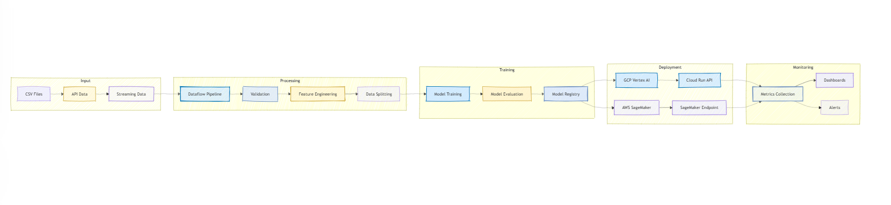

# Enterprise MLOps Platform


A production-grade MLOps platform for deploying, serving, and monitoring machine learning models at scale. The platform supports multi-cloud deployment (GCP/AWS), automated CI/CD, comprehensive monitoring, and enterprise-grade security features.

## Features

- **End-to-end ML Pipeline**: From data ingestion to model deployment
- **Multi-cloud Support**: Deploy to GCP Vertex AI or AWS SageMaker
- **Security**: JWT authentication, RBAC, and secret management
- **Monitoring**: OpenTelemetry tracing, Prometheus metrics
- **Robust CI/CD**: Automated testing, building, and deployment
- **Infrastructure as Code**: Terraform configuration
- **Experiment Tracking**: MLflow integration for model versioning

## Dataflow



The platform consists of several components:

1. **Data Processing Pipeline**: Apache Beam jobs for scalable data transformation
2. **Model Training Pipeline**: Configurable training with hyperparameter tuning
3. **Model Serving**: REST API endpoints with authentication and monitoring
4. **Deployment Infrastructure**: Cloud Run, Vertex AI, and Kubernetes options
5. **Monitoring Stack**: Prometheus, Grafana, and OpenTelemetry

## Getting Started

### Prerequisites

- Python 3.8+
- Docker and Docker Compose
- Google Cloud SDK
- AWS CLI (if using AWS features)
- Terraform 1.0+

### Installation

1. Clone the repository:

```bash
git clone https://github.com/adil-faiyaz98/mlops-platform.git
cd mlops-platform
```

2. Set up a virtual environment:

```bash
python -m venv venv
source venv/bin/activate  # On Windows: venv\Scripts\activate
```

3. Install dependencies:

```bash
pip install -r requirements.txt
```

4. Set up cloud credentials:

```bash
# For GCP
gcloud auth application-default login

# For AWS (if needed)
aws configure
```

5. Configure the environment:

```bash
cp config/config.example.json config/config.json
# Edit config.json with your project settings
```

## Data Processing

Process raw data using the data pipeline:

```bash
python src/data_processing/processing.py --input-data-uri gs://your-bucket/raw-data.csv --output-dir gs://your-bucket/processed-data/
```

## Model Training

Train a model using the ML pipeline:

```bash
python pipeline.py --input-data-uri gs://your-bucket/processed-data/ --output-dir ./models --deploy-env staging
```

## API Deployment

Deploy the model API to Cloud Run:

```bash
./scripts/deploy.sh --environment production
```

## Monitoring

Access monitoring dashboards:

- Prometheus: http://localhost:9090
- Grafana: http://localhost:3000

## Security

The platform implements several security features:

- JWT authentication for API access
- Least-privilege RBAC via service accounts
- Secret management for sensitive configuration
- Input validation to prevent injection attacks

## Configuration

Configuration is managed through:

1. JSON config files in `config/`
2. Environment variables for sensitive or deployment-specific values
3. Command-line arguments for one-time settings

## Testing

Run tests with pytest:

```bash
pytest tests/
```

Run load tests with Locust:

```bash
locust -f locustfile.py --host https://your-api-endpoint
```

## CI/CD Pipeline

The CI/CD pipeline automates:

1. Code quality checks and testing
2. Docker image building
3. Infrastructure deployment
4. Model validation and deployment
5. API deployment with traffic management

## Documentation

Additional documentation:

- [Cloud Strategy](docs/CLOUD_STRATEGY.md)
- [API Reference](docs/API_REFERENCE.md)
- [Deployment Guide](docs/DEPLOYMENT.md)
- [Monitoring Guide](docs/MONITORING.md)
- [Security Overview](docs/SECURITY.md)

1. Fork the repository
2. Create your feature branch (`git checkout -b feature/amazing-feature`)
3. Commit your changes (`git commit -m 'Add some amazing feature'`)
4. Push to the branch (`git push origin feature/amazing-feature`)
5. Open a Pull Request

## 📄 License

This project is licensed under the MIT License - see the [LICENSE](LICENSE) file for details.

## Acknowledgements

- [MLflow](https://mlflow.org) for experiment tracking
- [FastAPI](https://fastapi.tiangolo.com) for API development
- [Prometheus](https://prometheus.io) for metrics collection
- [OpenTelemetry](https://opentelemetry.io) for distributed tracing
- [Google Cloud](https://cloud.google.com) and [AWS](https://aws.amazon.com) for cloud infrastructure
