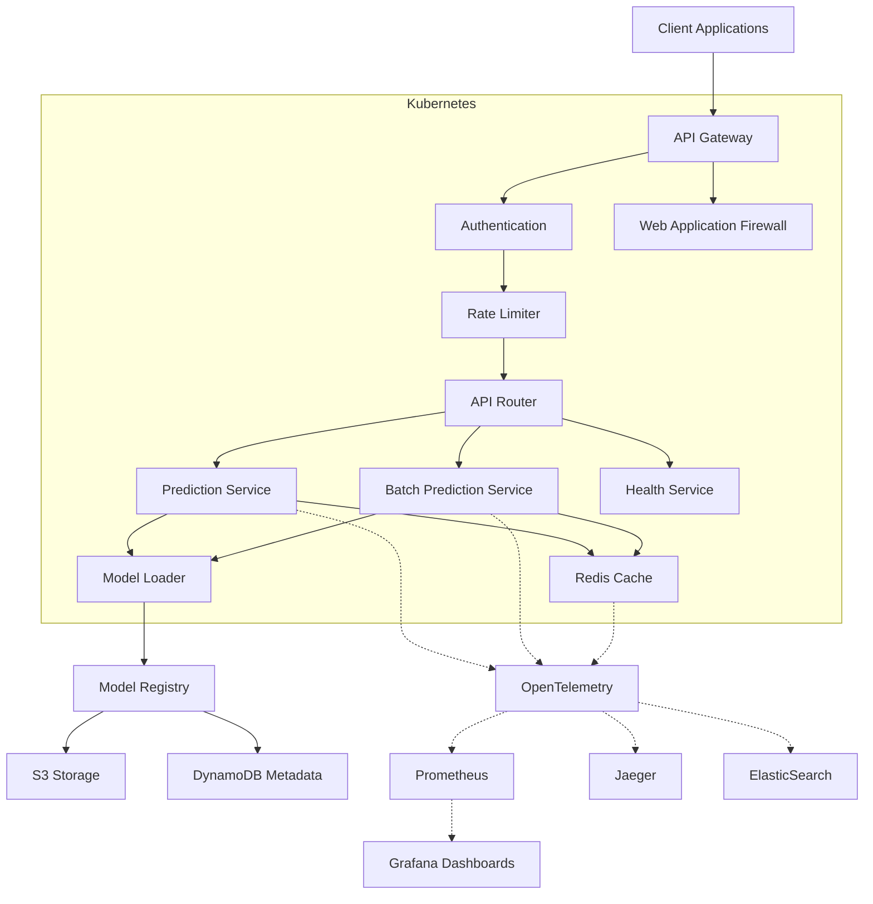

# MLOps Platform Architecture

## Overview

The MLOps Platform is designed as a production-ready system for serving machine learning models with high availability, scalability, and observability. This document outlines the overall architecture, components, and design decisions.

## High-Level Architecture Diagram



## System Architecture


Our architecture follows a microservices pattern with the following key components:

1. **API Gateway Layer**: Handles incoming requests, authentication, and routing
2. **MLOps API Service**: Core service for model serving and management
3. **Model Services**: Independent services for different model types
4. **Cache Layer**: Redis for response caching and rate limiting
5. **Model Registry**: Central storage for model artifacts and metadata
6. **Monitoring & Observability Stack**: Comprehensive monitoring solution

## Component Details

### API Gateway

The API Gateway is the entry point for all client requests. It provides:

- Request routing to appropriate services
- Rate limiting
- TLS termination
- Authentication verification
- Basic request validation

### MLOps API Service

The MLOps API Service is the core component that:

- Processes prediction requests
- Handles batch processing requests
- Manages model lifecycle operations
- Implements circuit breakers for downstream dependencies
- Provides health and readiness endpoints

### Redis Cache

Redis provides:

- Response caching for frequently requested predictions
- Rate limit token storage
- Temporary storage for batch job results
- Pub/sub capabilities for event distribution

### Model Services

Model Services are specialized containers that:

- Load ML models from the registry
- Provide prediction capabilities
- Handle model-specific preprocessing and postprocessing
- Report model-specific metrics

### Model Registry

The Model Registry is responsible for:

- Storing model artifacts
- Tracking model versions
- Maintaining model metadata
- Supporting model lifecycle operations

### Monitoring & Observability

Our monitoring stack includes:

- Prometheus for metrics collection
- Grafana for visualization
- Jaeger for distributed tracing
- Elasticsearch + Kibana for log aggregation and analysis

## Data Flow

1. Client sends prediction request to API Gateway
2. Request is authenticated and validated
3. MLOps API Service checks cache for existing predictions
4. If cache miss, appropriate Model Service is called
5. Prediction is cached and returned to client
6. All operations are traced and monitored

## Security Considerations

- All external communication is encrypted with TLS
- Authentication using API keys or OAuth2/OIDC
- Rate limiting to prevent abuse
- Web Application Firewall for common attack prevention
- Least privilege principle for all components
- Regular security scanning of container images

## Scalability

The system is designed to scale horizontally:

- All components are stateless (except Redis)
- Kubernetes autoscaling based on CPU/memory utilization
- Redis can be configured as a cluster for high availability
- Batch processing designed to handle large workloads efficiently

## Failure Modes and Recovery

The system is designed with resilience in mind:

- Circuit breakers prevent cascading failures
- Retries with exponential backoff for transient failures
- Health checks enable quick detection of failing components
- Kubernetes liveness/readiness probes ensure only healthy instances receive traffic

# MLOps API Reference

## Authentication

All API requests require authentication using either API Key or OAuth2 Bearer token.

### API Key Authentication

Include your API key in the `X-API-Key` header:

### OAuth2 Authentication

Include a Bearer token in the Authorization header:
Authorization: Bearer <token>

## Rate Limiting

The API implements rate limiting to protect the service. Limits vary by endpoint and authentication status:

- Anonymous users: 20 requests/minute
- Authenticated users: 100 requests/minute
- Sensitive endpoints: 10 requests/minute

When rate limiting is applied, the API returns a `429 Too Many Requests` response with a `Retry-After` header.

## Endpoints

### Health Check

#### GET /api/v1/health

Returns the health status of the API and its dependencies.

**Response Example:**

```json
{
  "status": "healthy",
  "version": "1.2.3",
  "environment": "production",
  "dependencies": {
    "redis": {
      "status": "healthy",
      "latency_ms": 2.5,
      "message": null,
      "last_check": "2023-08-15T12:34:56.789Z"
    },
    "model": {
      "status": "healthy",
      "latency_ms": 5.7,
      "message": null,
      "last_check": "2023-08-15T12:34:56.789Z"
    }
  },
  "uptime_seconds": 3600
}
```

### Prediction

#### POST /api/v1/predict

```json
{
  "inputs": [1.5, 2.0, 3.1, 4.2, 5.0],
  "parameters": {
    "return_probability": true
  }
}
```

**Response Example:**

```json
{
  "predictions": [
    {
      "id": "pred_123456",
      "output": "class_1",
      "probabilities": [0.1, 0.7, 0.2],
      "score": 0.7
    }
  ],
  "model_version": "v1.2.3",
  "model_name": "my_classification_model",
  "processing_time_ms": 25.4
}
```

### Batch Processing

#### POST /api/v1/batch

```json
{
  "inputs": [
    [1.5, 2.0, 3.1, 4.2, 5.0],
    [2.5, 3.0, 1.1, 2.2, 3.0]
  ],
  "parameters": {
    "return_probability": true
  }
}
```

**Response Example:**

```json
{
  "predictions": [
    {
      "id": "pred_123456",
      "output": "class_1",
      "probabilities": [0.1, 0.7, 0.2],
      "score": 0.7
    },
    {
      "id": "pred_123457",
      "output": "class_2",
      "probabilities": [0.2, 0.3, 0.5],
      "score": 0.5
    }
  ],
  "model_version": "v1.2.3",
  "model_name": "my_classification_model",
  "processing_time_ms": 45.2
}
```

### Error Response

```json
{
  "error": {
    "code": "invalid_input",
    "message": "Invalid input format",
    "details": "Expected array of numeric values but received string",
    "request_id": "req_abcd1234"
  }
}
```

### Common Errors

#### Client Errors

- 400 Bad Request - Invalid input format
- 401 Unauthorized - Authentication required
- 403 Forbidden - Access denied
- 404 Not Found - Resource not found
- 405 Method Not Allowed - Unsupported HTTP method
- 429 Too Many Requests - Rate limit exceeded

#### Server Errors

- 500 Internal Server Error - Unexpected error
- 501 Not Implemented - Endpoint not implemented
- 502 Bad Gateway - Service temporarily unavailable
- 503 Service Unavailable - Service unavailable
- 504 Gateway Timeout - Service timed out
- 505 HTTP Version Not Supported - Unsupported HTTP version
